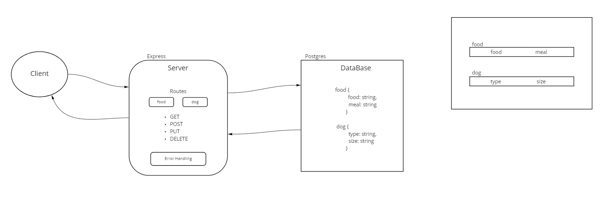

# basic-api-server

Creates basic API server using postgres DB deployed to herokum served with Express for Code Fellows 401

## HTTP Express Server deployed on Heroku.

Deployed at: https://cf-basic-api-server.herokuapp.com/

## Installation

to install run `git clone git@github.com:Kellen-Linse/basic-api-server`

`cd` into express-server-deployment

run `npm install`

## Usage

To start server run : `npm start`

To test server run: `npm test`

## Routes

* POST `/food/?food=<insert food>&meal=<insert meal>` - creates a food 
* POST `/dog/?type=<insert type>&size=<insert size>` - creates a food 
  
## Features

* Object 

        food {
          food: string,
          meal: string
        }

        dog {
          type: string,
          size: string
        }
